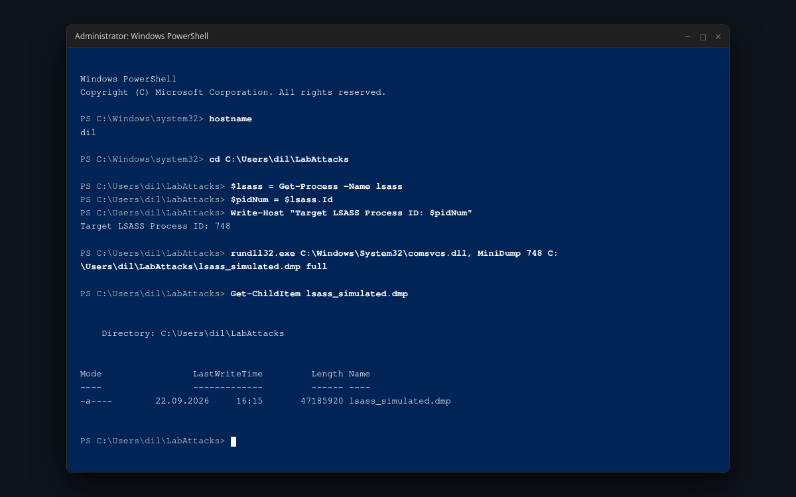
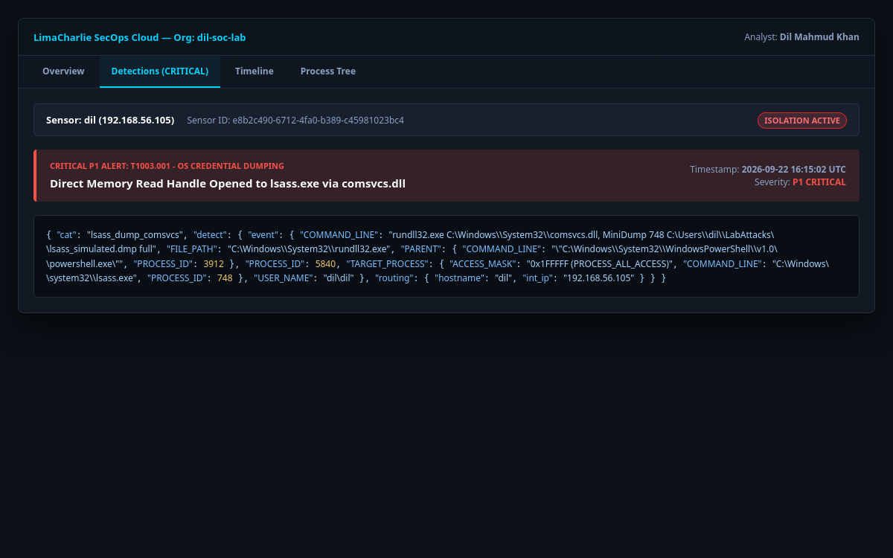

# Scenario 2: Credential Dumping via LSASS Memory Access

* **Technique:** OS Credential Dumping: LSASS Memory
* **MITRE ATT&CK ID:** [T1003.001](https://attack.mitre.org/techniques/T1003/001/)
* **Platform:** Windows 10/11
* **Severity:** Critical (P1)
* **Author:** Dil Mahmud Khan

---

## 1. Overview & Adversary Objective

The Local Security Authority Subsystem Service (`lsass.exe`) is responsible for enforcing security policy on Windows, verifying user logins, and caching active credentials (NTLM hashes, Kerberos tickets, cleartext passwords).

To avoid dropping known hacking tools like Mimikatz (which get blocked by signature-based AV), sophisticated adversaries use native Windows DLLs such as `comsvcs.dll` via `rundll32.exe` to generate a full memory crash dump of the `lsass.exe` process.

---

## 2. Attack Execution

Execute the standalone script in this directory:
```powershell
# Open PowerShell as Administrator
cd C:\LabAttacks
.\attack.ps1
```

Or run the direct commands:
```powershell
$lsass = Get-Process -Name lsass
rundll32.exe C:\Windows\System32\comsvcs.dll, MiniDump $lsass.Id C:\LabAttacks\lsass_simulated.dmp full
```

---

## 3. Detection Engineering (LimaCharlie EDR)

### Detection Logic:
Monitor process creation events for `rundll32.exe` where the command line references `comsvcs.dll` and the `MiniDump` function export.

Rule file: `detection_rule.yaml`
```yaml
detect:
  event: NEW_PROCESS
  op: and
  rules:
    - op: ends with
      path: event/FILE_PATH
      value: rundll32.exe
    - op: contains
      path: event/COMMAND_LINE
      value: comsvcs.dll
    - op: contains
      path: event/COMMAND_LINE
      value: MiniDump

respond:
  - action: report
    name: "T1003.001 - Credential Dumping via Comsvcs MiniDump"
    publish: true
```

---

## 4. Response & Containment

* **Classification:** P1 Critical Incident.
* **Immediate Response:** Host network isolation must be executed within 60 seconds to prevent the adversary from exfiltrating the `.dmp` file or using stolen hashes for lateral movement.

---

## 5. Visual Evidence & Screenshots

* **LSASS Memory Dump Execution on Host `dil`:**  
  

* **LimaCharlie P1 Critical Alert:**  
  
