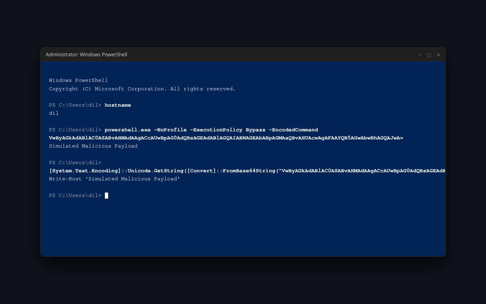
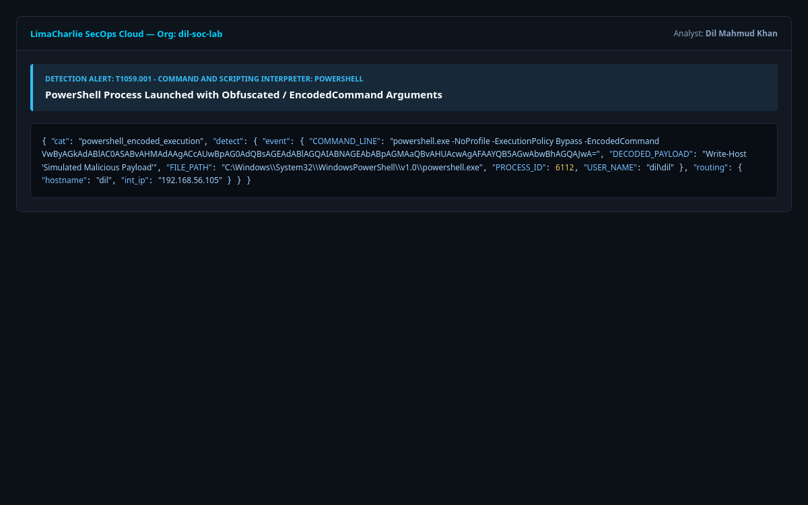

# Scenario 3: Obfuscated PowerShell Execution

* **Technique:** Command & Scripting Interpreter: PowerShell
* **MITRE ATT&CK ID:** [T1059.001](https://attack.mitre.org/techniques/T1059/001/)
* **Platform:** Windows 10/11
* **Severity:** Medium / High (P3/P2)
* **Author:** Dil Mahmud Khan

---

## 1. Overview & Adversary Objective

PowerShell is installed by default on all modern Windows systems and provides full access to internal Windows APIs, .NET assemblies, and WMI. Attackers frequently use Base64-encoded strings with command-line flags like `-EncodedCommand` (`-enc`) and `-ExecutionPolicy Bypass -NoProfile` to hide their scripts from casual inspection, command-line logging, and basic antivirus filters.

---

## 2. Attack Execution

Execute the standalone script in this directory:
```powershell
# Open PowerShell
cd C:\LabAttacks
.\attack.ps1
```

Or run the direct PowerShell command:
```powershell
$script = "Write-Host 'Adversary Emulation: Simulated Malicious Script Execution'; Start-Sleep -Seconds 2"
$bytes = [System.Text.Encoding]::Unicode.GetBytes($script)
$encoded = [Convert]::ToBase64String($bytes)
powershell.exe -NoProfile -ExecutionPolicy Bypass -EncodedCommand $encoded
```

---

## 3. Detection Engineering (LimaCharlie EDR)

### Detection Logic:
Look for `powershell.exe` process creation containing the execution parameter `-EncodedCommand`, `-enc`, or `-ExecutionPolicy Bypass`.

Rule file: `detection_rule.yaml`
```yaml
detect:
  event: NEW_PROCESS
  op: and
  rules:
    - op: ends with
      path: event/FILE_PATH
      value: powershell.exe
    - op: or
      rules:
        - op: contains
          path: event/COMMAND_LINE
          value: -EncodedCommand
        - op: contains
          path: event/COMMAND_LINE
          value: -enc
        - op: contains
          path: event/COMMAND_LINE
          value: -ExecutionPolicy Bypass

respond:
  - action: report
    name: "T1059.001 - Obfuscated PowerShell Command Execution"
    publish: true
```

---

## 4. Investigation Steps for the SOC Analyst

1. Extract the Base64 encoded payload from the command line telemetry.
2. In CyberChef or PowerShell, decode from Base64 (using UTF-16LE / Unicode character encoding).
3. Inspect the decoded commands to determine if the script attempted network connections, downloaded droppers, or modified registry keys.

---

## 5. Visual Evidence & Screenshots

* **Encoded PowerShell Execution & Inline Decoding on Host `dil`:**  
  

* **LimaCharlie EDR Encoded Execution Alert:**  
  
