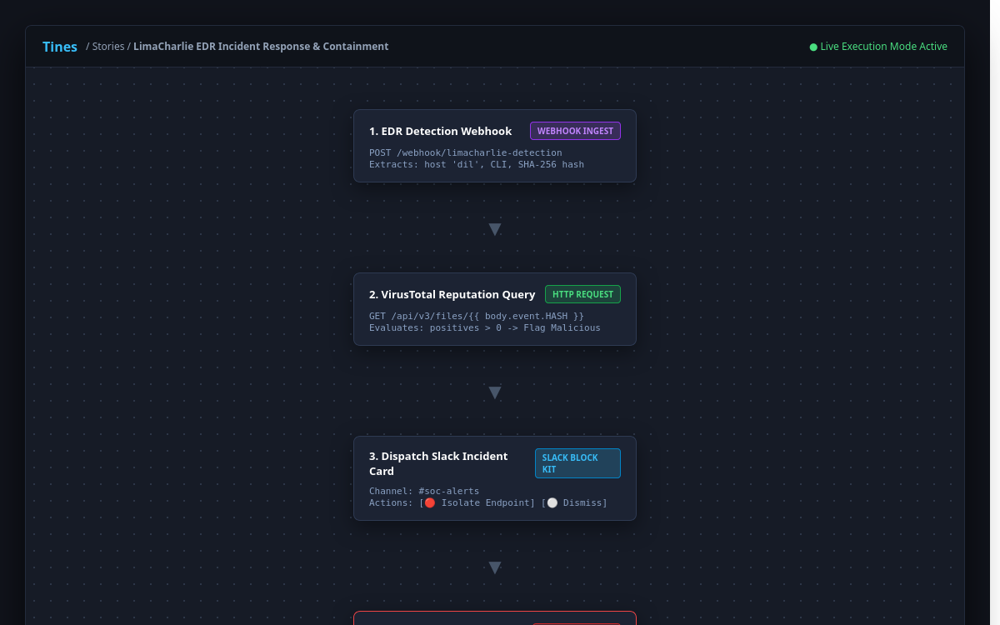
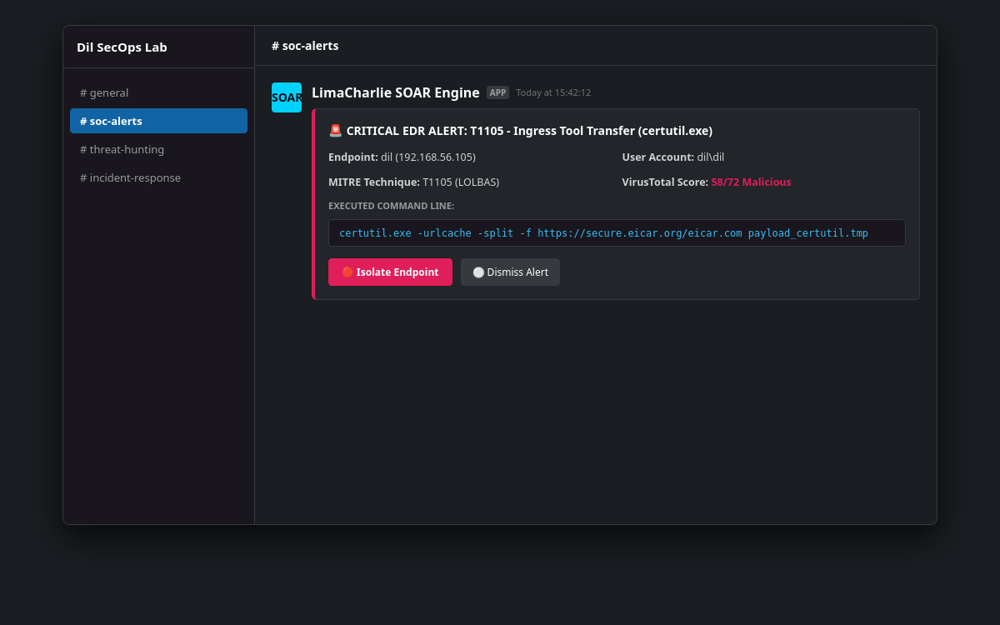
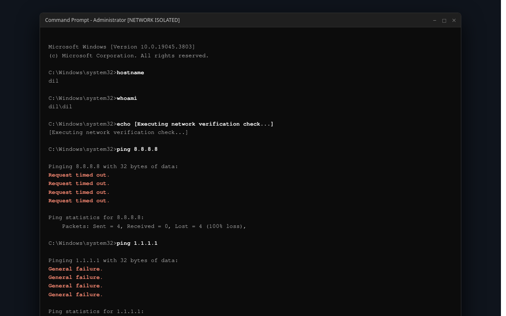

# SOAR Automation Playbooks

*Author: Dil Mahmud Khan*

This directory contains the automation playbooks used to orchestrate threat detection, enrichment, and response.

---

## 1. Cloud Tines SOAR Story (`tines_soar_story.json`)

This file is a complete export of the visual SOAR workflow.

### How to Import into Tines:
1. Log in to your free [Tines](https://www.tines.com) account.
2. Click **Stories** -> **Import Story**.
3. Select `tines_soar_story.json` or paste the JSON text directly.
4. Update the two placeholder values in your imported story:
   * Replace `YOUR_VT_API_KEY` with your VirusTotal API key.
   * Replace `YOUR_SLACK_WEBHOOK_URL` with your Slack Incoming Webhook URL.
5. Copy the generated Webhook Ingest URL and paste it into LimaCharlie's **Outputs** section.

---

## 2. Standalone Python SOAR Pipeline (`soar_pipeline.py`)

If you want to run or demonstrate the SOAR workflow programmatically without cloud dependencies, this script provides the exact same logic in Python.

### How to Run:
```bash
# Set your environment variables (optional, will run simulated mode if unset)
export VT_API_KEY="your_virustotal_key"
export SLACK_WEBHOOK_URL="your_slack_webhook"
export LC_API_KEY="your_limacharlie_key"

# Run the pipeline script
python3 soar_pipeline.py
```

### Features of the Python Script:
* Queries VirusTotal v3 API for file hashes.
* Formats Slack Block Kit JSON cards with interactive buttons.
* Prompts the analyst for human-in-the-loop confirmation.
* Sends network isolation commands to LimaCharlie REST API (`/v1/sensor/{sensor_id}/isolation`).

---

## 3. Visual Evidence & Playbook Artifacts

* **Tines Visual SOAR Canvas:**  
  

* **Interactive Slack Incident Card (#soc-alerts):**  
  

* **Endpoint Network Isolation Proof on Host `dil`:**  
  
